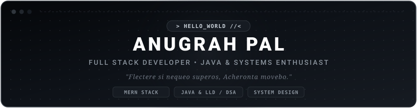

<div align="center">
  
</div>

<div align="center">
  <a href="https://git.io/typing-svg">
    
  </a>
</div>

<div align="center">
  <a href="https://www.linkedin.com/in/anugrah-pal/" target="_blank">
    
  </a>
  <a href="https://x.com/anugrah__pal" target="_blank">
    
  </a>
  <a href="https://discord.com/users/a9ugra6" target="_blank">
    
  </a>
  <a href="https://www.instagram.com/anugrahpal_/" target="_blank">
    
  </a>
  <a href="mailto:pal07anugrah@gmail.com" target="_blank">
    
  </a>
</div>

<br>

<div align="center">
  
</div>

<br>

---

### `// 01. ABOUT ME`

> *"Flectere si nequeo superos, Acheronta movebo."*

I am a Computer Science student passionate about building scalable, production-grade software, engineering clean architectures, and solving non-trivial algorithmic challenges. My primary technical depth centers on **Full-Stack Development (MERN)**, **Java Systems Engineering**, **Low-Level Design (LLD)**, and **Scalable System Architecture**.

- 🎓 **Education:** Computer Science at Vedam School of Technology
- 📍 **Location:** Pune, Maharashtra, India
- 💻 **Primary Focus:** Full Stack MERN Applications & Java Systems Architecture
- ⚡ **Current Grind:** DSA on LeetCode, Object-Oriented Design Patterns, Scalable Systems
- 💡 **Core Ethos:** Clean code, robust abstractions, and relentless problem-solving

---

### `// 02. TECHNICAL STACK & TOOLING`

#### ▫ Languages
<p align="left">
  
  
  
  
  
  
  
  
</p>

#### ▫ Frontend Development
<p align="left">
  
  
  
  
</p>

#### ▫ Backend & Architecture
<p align="left">
  
  
  
  
  
</p>

#### ▫ Databases & Cloud Services
<p align="left">
  
  
  
  
</p>

#### ▫ Tools & Environments
<p align="left">
  
  
  
  
  
  
  
</p>

---

### `// 03. FEATURED PROJECTS`

| Project | Tech Stack | Architectural Highlights | Status |
| :--- | :--- | :--- | :---: |
| **Tapovan Premier League** | <code>React</code> <code>Node.js</code> <code>MongoDB</code> | Real-time interactive player bidding and tournament auction platform with live state synchronization. | `Active` |
| **Java Low Level Design** | <code>Java</code> <code>OOP</code> <code>SOLID</code> | Implementation of classic GoF Design Patterns, clean object-oriented domain models, and decoupled systems. | `Building` |
| **Full Stack MERN Apps** | <code>React</code> <code>Express</code> <code>Node.js</code> <code>MongoDB</code> | Production-ready full-stack applications with secure JWT authentication, RESTful APIs, and responsive UI. | `Active` |
| **Algorithmic Solutions (DSA)** | <code>Java</code> <code>Data Structures</code> | Daily LeetCode solutions with optimal time & space complexities, documented approaches, and clean code. | `Continuous` |
| **Machine Learning Labs** | <code>Python</code> <code>Scikit-Learn</code> <code>Pandas</code> | Hands-on exploratory data analysis, predictive modeling experiments, and evaluation workflows. | `Exploring` |
| **Personal Portfolio Website** | <code>React</code> <code>Tailwind CSS</code> <code>Vite</code> | Personal engineering showcase highlighting projects, technical writings, and professional journey. | `Upcoming` |

---

### `// 04. ENGINEERING ROADMAP & GOALS`

```
┌──────────────────────────────┬──────────────────────────────┬──────────────────────────────┐
│  ⚡ CURRENT FOCUS             │  🎯 2026 MILESTONES          │  💡 ENGINEERING PHILOSOPHY   │
├──────────────────────────────┼──────────────────────────────┼──────────────────────────────┤
│ • Production MERN Apps       │ • Master Scalable Systems    │ • High cohesion, low coupling│
│ • Object-Oriented LLD (Java) │ • Advanced DSA Proficiency   │ • Readable > clever code     │
│ • Scalable System Design     │ • Ship full-scale SaaS apps  │ • Understand from first prin.│
│ • Open Source Contributions  │ • Real-world AI integrations │ • Consistent deliberate grind│
└──────────────────────────────┴──────────────────────────────┴──────────────────────────────┘
```

---

### `// 05. REPOSITORY DIRECTORY`

This GitHub profile serves as my continuous engineering journal:

- [`Java-DSA`](https://github.com/anugrah-pal) — Daily algorithmic problem solving with optimal complexities and notes.
- [`Java-LLD`](https://github.com/anugrah-pal) — Object-Oriented Design, SOLID principles, and design pattern architectures.
- [`MERN-Projects`](https://github.com/anugrah-pal) — End-to-end full-stack web applications and robust REST APIs.
- [`Machine-Learning`](https://github.com/anugrah-pal) — Practical machine learning models, notebooks, and data experiments.
- [`System-Design-Notes`](https://github.com/anugrah-pal) — Architectural diagrams, trade-off analyses, and scalability studies.

---

### `// 06. ACTIVITY & METRICS`

<div align="center">
  
  <br><br>
  
</div>

<br>

---

<div align="center">
  <sub>Designed with a minimalist monochrome aesthetic • <b>Anugrah Pal</b></sub>
</div>
